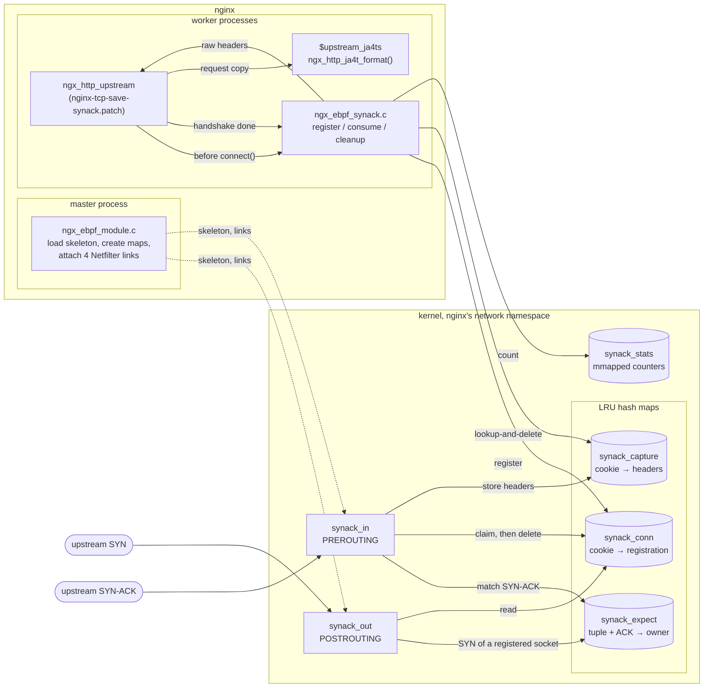
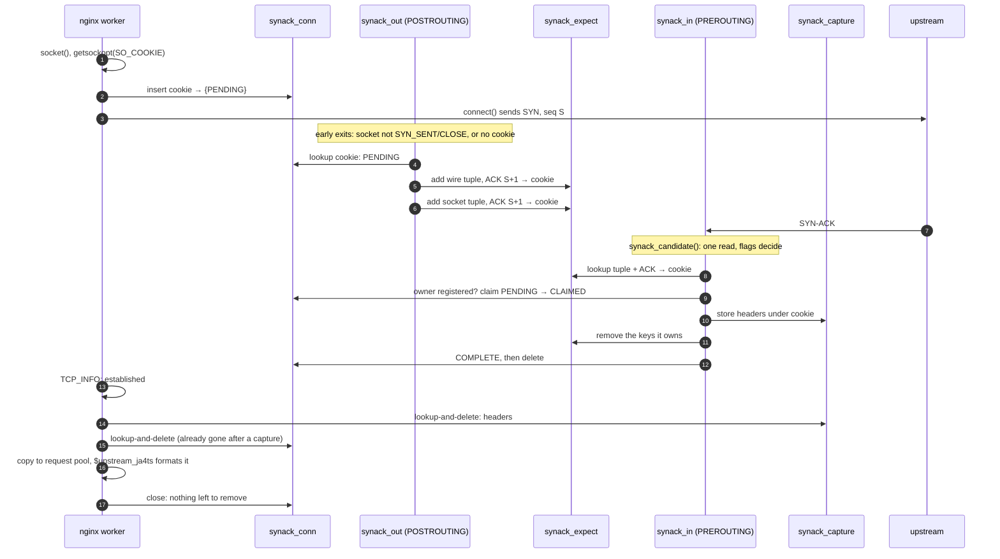
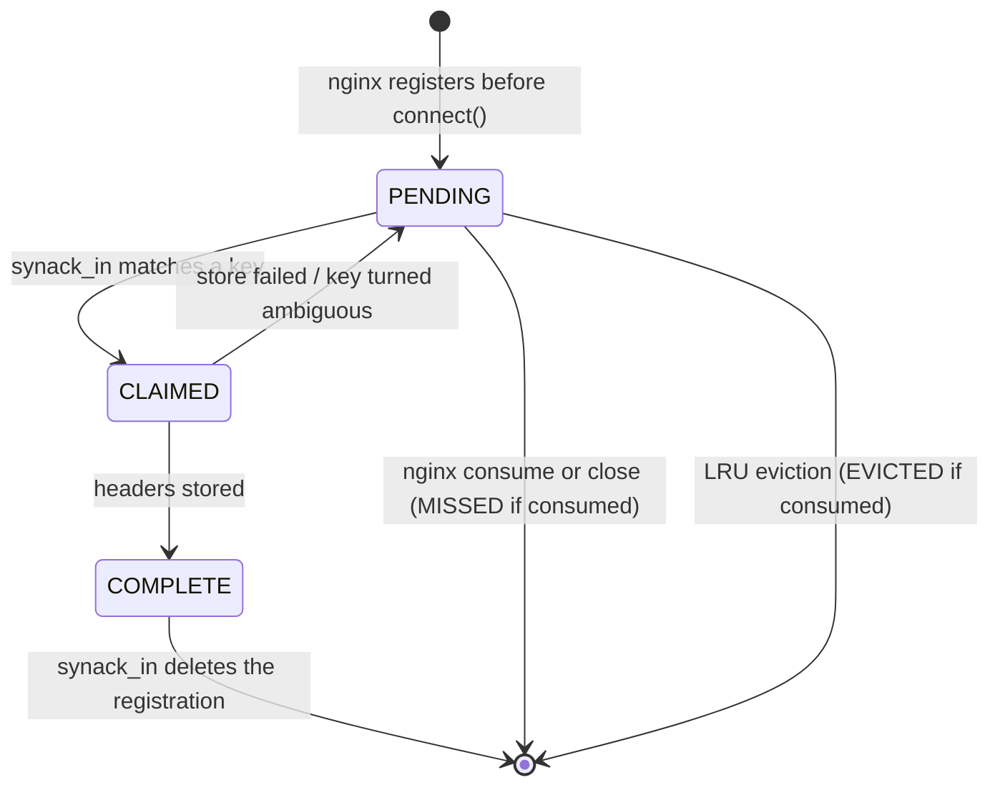

# JA4TS: upstream SYN-ACK capture design

`$upstream_ja4ts` fingerprints the SYN-ACK that nginx receives from the upstream
server that served the request. nginx cannot read the SYN-ACK through a socket
API, so two small Netfilter BPF programs capture it in the kernel. nginx hands
each connection's captured headers to the JA4T formatter.

This document describes how that works and why it is built this way. It also
records the alternatives that were measured and rejected. For configuration see
the [README](../README.md#ja4ts). For test commands see
[test/ebpf/README.md](../test/ebpf/README.md).

## Big picture

Where the two programs sit in Netfilter, in the style of the Netfilter hacking
HOWTO. nginx's SYN leaves through `[5]` and `[4]`, and the upstream's SYN-ACK
comes back through `[1]` and `[2]`. `synack_out` is the last hook to see the
SYN, after SNAT; `synack_in` is the first to see the SYN-ACK, before defrag,
conntrack and NAT. What ties them to nginx is the registration: before
`connect()`, the worker writes the socket cookie into `synack_conn`.
`synack_out` reads it to recognize nginx's SYN, and `synack_in` claims it, and
deletes it once the SYN-ACK is stored.

```
            SYN-ACK in                           SYN out
                |                                   ^
                v                                   |
                --->[1]--->[ROUTE]--->[3]--->[4]--->+
                     *        |               ^ ******************
           synack_in *        |               |           read   * synack_out
        (first hook) *        |            [ROUTE]               v (last hook)
                     *        |               ^         +-----------------+
                     *        v               |         |   synack_conn   |
                     *       [2]             [5]        | cookie: PENDING |
                     *        |               ^         +-----------------+
                     *        |               |             ^         ^
                     *        v               |             |         *
                     *   +------------------------+         |         *
                     *   |      nginx worker      |---------+         *
                     *   +------------------------+ register,         *
                     *                              before connect()  *
                     *                                                *
                     **************************************************
                       claim it; delete it once the SYN-ACK is stored

  [1] PREROUTING  [2] LOCAL_IN  [3] FORWARD  [4] POSTROUTING  [5] LOCAL_OUT
  ---> packet path    ***> BPF program access to the map
```

One upstream connection, step by step:

```
  nginx worker                   BPF maps                  BPF programs / wire
  ------------                   --------                  -------------------
1 register the socket cookie --> synack_conn
  (before connect)               cookie -> PENDING

2 connect() sends SYN, seq S ----------------------------> [4] synack_out
                                 synack_conn  -----------> registered and
                                                           PENDING?
                                 synack_expect <---------- yes: add 2 keys
                                 (wire + socket tuple,
                                  ACK S+1) -> cookie

3                                                          [1] synack_in
                                                           <-- SYN-ACK arrives
                                 synack_expect ----------> key -> cookie
                                 synack_conn  <----------- claim, then delete
                                 synack_capture <--------- store the headers

4 handshake done: consume <----- synack_capture
  (lookup-and-delete)

5 $upstream_ja4ts = JA4T format of the headers
```

Everything else in the namespace passes the hooks cheaply: outbound packets
after a socket field read or two, inbound ones after one short header read
(see [Performance](#performance)). The sections below follow the same steps in
detail.

## Goals and non-goals

Goals:

- Capture the SYN-ACK of every upstream TCP connection that has capture enabled,
  as its IP/TCP headers were observed at early PREROUTING.
- Work across conventional DNAT/SNAT, for IPv4, IPv6 and IPv4-mapped sockets.
- Stay out of the way:
  - Capture is optional metadata. A failure never fails proxied traffic.
  - The per-packet cost for everything else in the network namespace is close
    to the cost of running a BPF program at all.
  - Nothing runs periodically, and nothing blocks a CPU.
- Need no external daemon, pinning, cgroup enrollment or sockops. The nginx
  build needs libbpf but no BPF toolchain.

Non-goals, and their current limits, are in [Limits](#limits).

## Framework



### Components

| Piece | Role |
| --- | --- |
| `patches/nginx-tcp-save-synack.patch` | The `tcp_save_synack` directive. Registration in `ngx_event_connect_peer()`, consume points in `ngx_http_upstream`, cleanup in `ngx_close_connection()`, and the connection and upstream-state fields. |
| `ebpf/ngx_ebpf_module.c` | The loader, a static core module. The master opens and loads the skeleton, mmaps the stats, and attaches the four links. Exit and reload handling. |
| `ebpf/ngx_ebpf_synack.c` | The per-connection side, run by workers: register, consume, cleanup, and the `EVICTED`/`MISSED` accounting. |
| `ebpf/ngx_ebpf_synack.h` | Private shared state: the map descriptors, the stats pointer, `ngx_ebpf_count()`. |
| `ebpf/ngx_ebpf_module.h` | The public API the patch includes. |
| `ebpf/ngx_ebpf.h` | The private contract between nginx and the BPF programs: map value layouts, limits and counter indexes. Both sides must come from the same revision. |
| `ebpf/bpf/ngx_ebpf.bpf.c` | `synack_out`, `synack_in` and the maps. |
| `ebpf/ngx_ebpf.skel.h` | The committed libbpf skeleton with the compiled CO-RE object embedded. |
| `ebpf/gen-skel.sh` | Regenerates the skeleton. |
| `src/ngx_http_ja4t.c` | `ngx_http_ja4t_format()`, shared with JA4T, turns raw SYN or SYN-ACK headers into `window_options_mss_wscale`. |

`gen-skel.sh` uses clang, bpftool and kernel BTF; `bpftool gen object` drops
DWARF and keeps BTF. Its output is byte-identical wherever it runs. It records a
sha256 of its inputs (the two sources and the compiler flags, not the script),
and `--check`, run by CI, rejects a stale skeleton.

## Data path



### Registration

For each new upstream TCP connection whose location has `tcp_save_synack on`,
`ngx_connection_register_synack()` runs before `connect()`:

1. It reads the socket cookie with `SO_COOKIE`. The kernel assigns the cookie on
   first use, so asking before `connect()` guarantees that the SYN's socket
   carries it.
2. It inserts `{phase = PENDING}` under that cookie.

Cookies are never reused. Failures only lose the metadata and count as
`REGISTER_FAILED`. UDP, Unix sockets and QUIC never register. The effective
setting is latched on each new connection: keepalive reuse never starts a
capture, and an off request always sees an empty value.

### SYN: `synack_out` (POSTROUTING)

Every outbound packet in the namespace reaches this hook. Only a registered
socket's SYN matters, so two socket fields, read with CO-RE, decide before any
map access:

- **State.** A TCP socket sends SYNs, first and retransmitted, only in
  `SYN_SENT`. Established TCP and connected UDP, the bulk of traffic, leave here.
  `CLOSE` also passes: unconnected raw and UDP sockets report it (the tests
  inject crafted SYNs from a raw socket), and a TCP socket in `CLOSE` sends no
  data.
- **Cookie.** It is zero until someone asks for it, and nginx asks before
  registering. Sockets that never asked leave here.

Then the program checks, in order:

1. The registration must exist and be `PENDING`.
2. It parses the headers.
3. The SYN flag must be set with ACK and RST clear.

For sequence number S it records up to two expectation keys, each owned by the
cookie:

| Key | ACK |
| --- | --- |
| The outgoing packet's tuple, reversed (after SNAT) | S + 1 |
| The socket's own tuple, reversed (before NAT) | S + 1 |

The packet key matches replies before reverse NAT. The socket key matches
same-namespace loopback replies after reverse NAT in OUTPUT. IPv4-mapped sockets
normalize to the IPv4 representation, and ACK arithmetic wraps modulo 2^32.

Each key is 44 bytes, and every unused byte is zero, so keys compare as plain
memory:

| Field | Encoding |
| --- | --- |
| family | native-endian |
| protocol | 6 |
| padding | zero |
| source and destination addresses | 16 bytes each; IPv4 in the first four bytes |
| ports and ACK | network order |

The layout is in `ebpf/ngx_ebpf.h`.

Other cases:

- **Retransmitted SYN.** It re-adds the same keys.
- **More aliases.** A third distinct alias, e.g. from a SYN with another sequence
  number, is skipped and counted as `ALIAS_FULL`.
- **Collision with a live owner.** A key already owned by another cookie whose
  registration still exists is marked ambiguous (`COLLISION`). Neither owner
  matches it, and it stays a tombstone until the LRU map evicts it.
- **Owner gone.** A key whose recorded owner has no registration left is taken
  over as if absent.
- **TCP Fast Open.** Stock nginx never enables it upstream, so a SYN-ACK that
  acknowledges SYN data (S + 1 + N) never matches.

### SYN-ACK: `synack_in` (PREROUTING)

Every inbound packet reaches this hook. The packet has no socket yet, so the TCP
flags byte is the first thing that can decide.

`synack_candidate()` reads first. One probe read of 34 or 54 bytes covers the IP
header and the flags for IPv4 without options and IPv6 without extension
headers, and those packets are decided at once. It answers "not a SYN-ACK" only
where the full parse could not yield one either: not TCP, a fragment, other
flags. IPv4 options, IPv6 extension headers and short reads fall through to
`synack_parse_packet()`, which is unchanged.

For a SYN-ACK (SYN and ACK set, RST clear), the program:

1. Matches the complete key.
2. Requires the owner's registration and atomically claims it
   (`PENDING → CLAIMED`).
3. Rechecks that the key is still unambiguous and owned by that cookie.
4. Stores the headers under the cookie.
5. Marks the registration `COMPLETE`, removes the keys it owns, and deletes the
   registration.

A failed store releases the claim (`CAPTURE_FULL`). The capture record then
replaces the registration, and nothing can recreate it: a late or duplicate
SYN-ACK finds no registration.



### Raw bytes

The record is `{version, length, headers[256]}` and is zero-filled.
`SYNACK_VERSION` is 2.

- **Copied:** only complete IP/TCP headers, as observed at early PREROUTING.
- **Supported inside the 256-byte bound:** IPv4 options, and up to eight IPv6
  hop-by-hop, routing, destination and AH headers.
- **Rejected:** fragments, jumbograms, ESP, malformed or oversized chains,
  invalid TCP offsets, and header bytes outside the linear part of the socket
  buffer.
- **Kept as seen:** original length and checksum fields; checksum-offload
  representation is accepted.

Changes made earlier by XDP, TC, local OUTPUT or another namespace cannot be
undone.

### Consume and close

The HTTP upstream code calls `ngx_connection_save_synack()` at each of these
points:

- at connect, covering keepalive reuse
- after the connect test, before TLS
- before sending the request
- when moving to the next upstream
- at finalization

The first call that finds the handshake done (`TCP_INFO`: `ESTABLISHED` or
`CLOSE_WAIT`) makes the one consume attempt:

1. `lookup-and-delete` on the capture.
2. `lookup-and-delete` on the registration, with the owned keys removed if the
   registration is still pending.
3. It classifies the result:

| Found | Meaning | Counter |
| --- | --- | --- |
| capture | captured | `CAPTURED` (counted in BPF) |
| registration only | the SYN-ACK was not captured | `MISSED` |
| neither | the LRU maps evicted one of them | `EVICTED` |
| lookup error | | `HANDOFF_ERROR` |

The record's version and length are validated, and it becomes
`c->saved_synack` in connection-pool storage (`INVALID_RECORD` or `ALLOC_FAILED`
otherwise). Each enabled attempt copies the bytes to its request pool, so
log-phase evaluation survives the upstream connection's close or return to the
keepalive pool. A retry starts a new, empty snapshot.

`ngx_close_connection()` removes whatever is still registered. After a consume
that is nothing, so a normal connection costs two map operations at consume and
none at close.

### The variable

`$upstream_ja4ts` returns `window_options_mss_window-scale`, formatted by the
JA4T code with the same option ordering, missing-field, MSS padding and
zero-scale rules. JA4TS has no hashed form, so there is no `_string` variant.

- **Final attempt only:** it reads only the final upstream attempt and never falls
  back to an earlier one.
- **Not cached:** it is non-cacheable, so an early empty read does not suppress a
  later value.
- **Empty value:** no upstream, capture disabled where the request was proxied,
  refused connections, Unix sockets and missing records.
- **Available in:** response headers and access logs.

## Maps and counters

| Map | Type | Key | Value | Capacity |
| --- | --- | --- | --- | ---: |
| `synack_conn` | LRU hash | cookie | `{phase, count, keys[2]}` | 65,536 |
| `synack_expect` | LRU hash | 44-byte tuple + ACK | `{cookie, ambiguous}` | 131,072 |
| `synack_capture` | LRU hash | cookie | `{version, length, headers[256]}` | 65,536 |
| `synack_stats` | array, mmapable | counter index | `u64` | 12 |
| `synack_scratch` | per-CPU array | 0 | one record, transient | 1 |

The counters are updated with atomic adds by BPF and by nginx. They are read by
index, so new ones are appended:

| # | Counter | Counted when |
| ---: | --- | --- |
| 0 | `EXPECT_FULL` | an expectation insert lost a race (LRU: never for lack of room) |
| 1 | `ALIAS_FULL` | a third distinct key for one connection |
| 2 | `COLLISION` | a key already owned by another live registration |
| 3 | `CAPTURE_FULL` | a capture insert lost a race; the claim is released |
| 4 | `CAPTURED` | a SYN-ACK stored |
| 5 | `EXPIRED` | retired: counted sweeper expiries, always 0 now |
| 6 | `REGISTER_FAILED` | `SO_COOKIE` or the registration insert failed |
| 7 | `ALLOC_FAILED` | the pool allocation for a consumed record failed |
| 8 | `HANDOFF_ERROR` | the consume lookup failed other than "not found" |
| 9 | `INVALID_RECORD` | a consumed record with a bad version or length |
| 10 | `EVICTED` | at consume: neither registration nor capture left |
| 11 | `MISSED` | at consume: registration still pending, no capture |

`MISSED` should roughly equal `EXPECT_FULL + CAPTURE_FULL + ALIAS_FULL +
COLLISION`. Unexplained misses mean the traffic took a path the programs cannot
see (see [Limits](#limits)), or a bug. An expectation key evicted under pressure
also shows as `MISSED`, because its registration survives.

## Lifetime and failure handling

- **No time.** Nothing carries a deadline and the programs never read the clock.
  A registration lives as long as its socket: nginx removes it at consume or
  close, and `synack_in` removes it when it stores a capture. A capture can only
  come from its own socket's SYN-ACK and is consumed right after the handshake.
  A key whose owner is gone matches nothing and is taken over by the next owner.
- **No sweep.** What a failure leaves behind (a crashed worker's registrations, a
  missed SYN-ACK's keys, an ambiguous key) is never looked up again, so the LRU
  maps evict it first when an insert needs room. That is bounded work per
  insert, with no periodic pass in the kernel or a worker.
- **Past capacity** (more than ~65k connections in flight at once), an insert
  evicts the oldest live entry instead of failing. That connection loses its
  fingerprint and is counted as `EVICTED` (or `MISSED`, for an evicted key).
  LRU maps also evict slightly before they are full, by up to about
  128 × CPUs entries, because of per-CPU free-slot caches.
- **Ownership outside cycle pools.** The maps and links belong to the process, not
  to a configuration cycle. With no enabled configuration there are no maps or
  links, and `nginx -t` and signal-only invocations never touch BPF.
- **Startup.** Explicitly enabled capture that cannot initialize fails startup:
  permission errors name the capabilities (root, or `CAP_BPF`, `CAP_PERFMON`
  and `CAP_NET_ADMIN`), and libbpf's reasons go to the error log at `notice`.
  Workers inherit the descriptors and need no BPF capabilities (verified on
  6.8).
- **Reload.** Graceful reload reuses the maps and links. Existing connections keep
  their policy and new ones use the new configuration. Enabling capture from an
  entirely disabled running instance requires a restart; such a reload is
  rejected without stopping the master.
- **Several instances.** Netfilter allows one BPF program per hook and priority.
  The master attaches both PREROUTING links (IPv4, IPv6) at `INT_MIN + 1` before
  either POSTROUTING link at `INT_MAX - 1`, and a process that finds those taken
  moves inward to the next free priority, up to 64. Several capture-enabled
  nginx instances can therefore share a namespace, each with its own maps. When
  all 64 are taken, startup fails with a message that says so.
- **Binary upgrade.** On `USR2`, the new master loads its own object at the next
  free priorities and both capture until the old master quits. No state is
  handed over.
- **Exit.** Workers close their references without detaching shared links, and
  the last close releases everything.

## Performance

These numbers come from the test VM (QEMU, hpet clocksource), with `bpf_stats`
timing included. On hardware with a TSC or kvm-clock expect them to be lower.

| Path | Cost |
| --- | --- |
| `synack_out`, any packet not from a registered connecting socket | ~150–160 ns: two field reads |
| `synack_in`, any inbound packet that is not a SYN-ACK | ~180 ns: one probe read (IPv4 226 → 182 ns, IPv6 236 → 183 ns after `synack_candidate()`) |
| A new upstream connection, all runs of both programs | ~6–7 µs |
| A new upstream connection, nginx syscalls | about five (`SO_COOKIE`, register, `TCP_INFO`, two lookup-and-deletes) |

On this VM, running any program at all costs about 150 ns, so both hooks are now
close to that floor for traffic that is not ours. `bench.py` reports on/off
throughput and per-program costs. Throughput differences under about 10% are
noise on the VM; for per-program changes, compare objects in a private-namespace
microbenchmark instead.

## Decisions and rejected alternatives

1. **nginx-owned registration by socket cookie** replaces an earlier
   sockops/partial-tuple proposal. It needs no cgroup enrollment, no conntrack
   queries and no external daemon.
2. **Two keys per SYN** (packet and socket tuple, with ACK S + 1) make capture
   work across DNAT/SNAT without conntrack.
3. **A committed skeleton** means building nginx needs libbpf but no BPF
   toolchain. `gen-skel.sh` is byte-identical wherever it runs: it compiles a
   copy of the inputs by relative paths in a fixed-length directory, because
   absolute and `$TMPDIR` path lengths changed clang's type order.
4. **LRU maps, no sweeper.** Options considered, in order:
   - **The original userspace sweeper** (a worker holding a lease; 1/64 of each
     map per second, 2–3 syscalls per key). It took up to 64 s for a full pass,
     used ~7 ms of a worker per second with full maps, and its cursor restarted
     from the first key whenever the saved key was deleted, so under churn it
     never reached the tail.
   - **An in-kernel `bpf_timer` pass every 5 s.** It was implemented and
     measured: 1.27 ms per pass for the bucket walk alone, ~61 ns per live
     entry, ~185 ns per deleted entry, and 12.9 ms with full maps, all in one
     CPU's softirq. Rejected so as not to block the kernel.
   - **Staggering one map per tick** only brought it from 12.6 to 11.4 ms, because
     the cost is per live entry.
   - **A budgeted partial pass** cannot resume (`bpf_for_each_map_elem()` always
     starts at bucket 0) and stalls once the budget is filled by live entries.
   - **An expiry queue or per-entry timers** would add work to every connection
     for what are now rare expirations.
   - **Plain hash maps with explicit full errors** would keep failure accounting
     exact, but need a sweeper. LRU was chosen, and the accounting is kept by
     `EVICTED`/`MISSED` at consume.
5. **No clock.** `bpf_ktime_get_ns()` costs ~22 µs on the hpet VM. It ran twice per
   new connection: ~44 of the ~49 µs of BPF work, and bench.py's −13%.
   `bpf_ktime_get_coarse_ns()` is not available to Netfilter programs (the 6.8
   verifier rejects it), and jiffies do not match userspace's clock. Once the
   maps were LRU the deadlines protected nothing, so they were removed.
   Staleness is decided by owner liveness (does the key's owner still have a
   registration) instead. A jiffies-keyed clock cache was also declined.
6. **Early exits before any map access.** In `synack_out`: the socket state and
   cookie (keepalive traffic 270 → 157 ns/run). In `synack_in`:
   `synack_candidate()`. Both only ever skip packets that could not be captured
   anyway.
7. **Next free priority per instance** instead of a fixed priority. A fixed one
   made a second capture-enabled nginx, and the new master of a binary upgrade,
   fail with `EBUSY`, and the error blamed the kernel version.
8. **Split nginx side:** the loader (`ngx_ebpf_module.c`, master, process
   lifetime) and the per-connection capture (`ngx_ebpf_synack.c`, workers).

## Limits

- **Kernel.** Linux 6.4 or newer with kernel BTF (Netfilter BPF links).
- **Linear headers only.** Only IP/TCP headers in the linear part of the socket
  buffer are read. Drivers that leave the TCP header in page fragments at
  PREROUTING produce no capture; the request still succeeds with an empty value.
- **Early rewrites.** XDP, TC, OUTPUT and other-namespace rewrites made before
  early PREROUTING cannot be undone. Arbitrary TCP sequence rewriting is not
  supported.
- **Out of scope:** stream proxying, TCP Fast Open on upstream connections, and
  retransmission timing or RST suffixes.
- **64 instances.** At most 64 capture-enabled processes per network namespace.
- **Unprivileged workers on 6.4** with `kernel.unprivileged_bpf_disabled` set are
  unverified.
- **Silent eviction past capacity,** counted as described in
  [Maps and counters](#maps-and-counters). An ambiguous key evicted under
  pressure could let a later owner of the same tuple and ISN take it over, which
  is negligible.

## Testing

The suites are described in [test/ebpf/README.md](../test/ebpf/README.md):

| Suite | Covers |
| --- | --- |
| `capture.py` | The production object driven directly: crafted packets, map states, eviction, ownership, real TCP through NAT. It is also the cross-kernel CO-RE check. |
| `nginx.py` | nginx lifecycle: handoff, the eviction and miss counters, reload, several instances, binary upgrade, resource release. |
| `soak.py` | Correctness under load, packet loss and duplication. Every fingerprint must land on its own response, and `EVICTED` and `MISSED` must stay 0. |
| `ja4ts-*.t` | Directive parsing and variable behavior through nginx, including NAT and IPv6. |
| `bench.py` | The overhead report. |

CI (`.github/workflows/test-ebpf.yaml`) runs these jobs:

| Job | What it does |
| --- | --- |
| build | checks the skeleton, then builds the instrumented nginx |
| privileged | runs the suites as root |
| kernel-6-4 | runs `capture.py` on Ubuntu's mainline 6.4.0 kernel in virtme-ng under KVM |
| unprivileged | runs `ja4ts-config.t` as a normal user |
| build-matrix | builds three production variants |

Test-only instrumentation (`-DNGX_SYNACK_TEST=1`) adds:

- raw-header inspection
- `NGX_SYNACK_TEST_ALLOC_FAIL`
- `NGX_SYNACK_TEST_EVICT`
- `NGX_SYNACK_TEST_MISS`

None of these exist in production builds.
